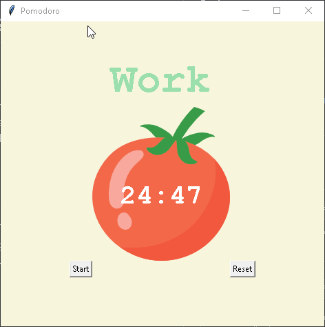

# 🍅 Pomodoro Timer 🍅

A simple Pomodoro Timer built with Python using the `pygame` library for sound effects and `Tkinter` for the Graphical User Interface (GUI). This app helps you manage your work and break intervals, keeping you productive with timed sessions.

## Features

- **Pomodoro Technique**: 25-minute work intervals, with short and long breaks.
- **Sound Notifications**: Plays sound when the work or break session ends.
- **Visual Countdown**: A clear countdown timer displayed on the interface.
- **Progress Tracker**: Displays checkmarks for completed work sessions.

## How It Works

- The timer alternates between **work** and **break** periods.
  - **Work** sessions are 25 minutes.
  - **Short breaks** are 5 minutes.
  - **Long breaks** are 20 minutes after every 4 work sessions.
- You can reset the timer at any time, and the progress is tracked with checkmarks for completed sessions.

## Requirements

- Python 3.x
- `pygame` library
- `tkinter` (usually included with Python installations)

To install the required libraries, you can run the following:

```bash
pip install pygame
```

## Usage

1. Run the script to launch the Pomodoro Timer.
2. Click the **Start** button to begin the first work session.
3. The timer will switch between work and break intervals.
4. The timer will play a sound when a session (work or break) is completed.
5. Click **Reset** to stop the timer and reset the progress.

## Demo GIF



## Technologies Used

- **Python**
- **Tkinter**: For the GUI.
- **Pygame**: For playing sound notifications.

---

👨‍💻 Created by [Tsaousidis](https://github.com/Tsaousidis)  
💼 Enjoy your work and stay productive! 💼
